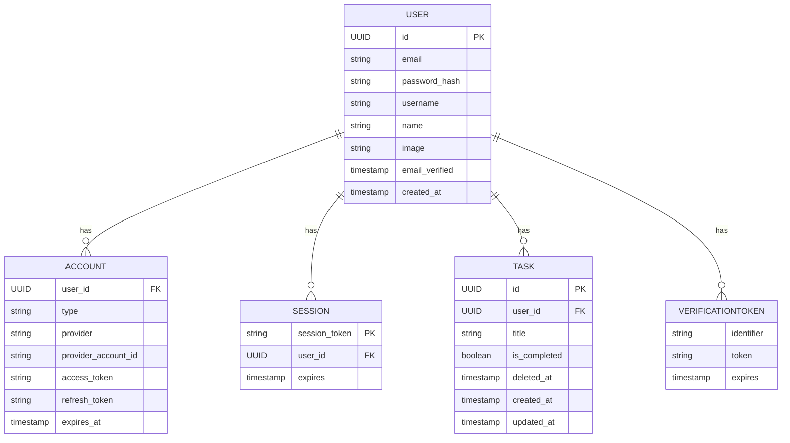
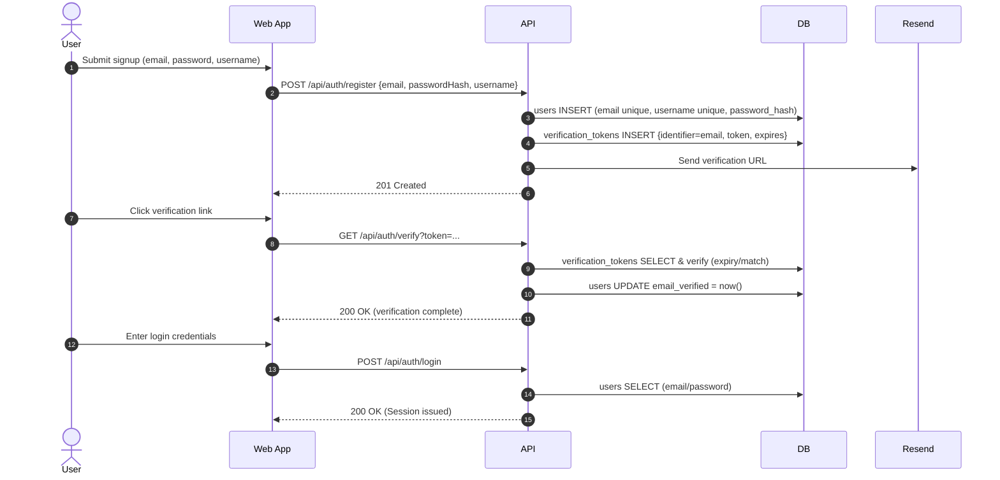
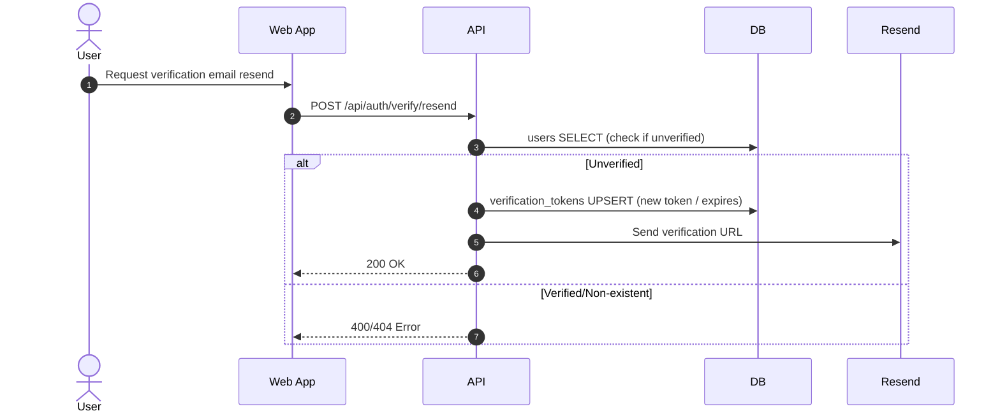
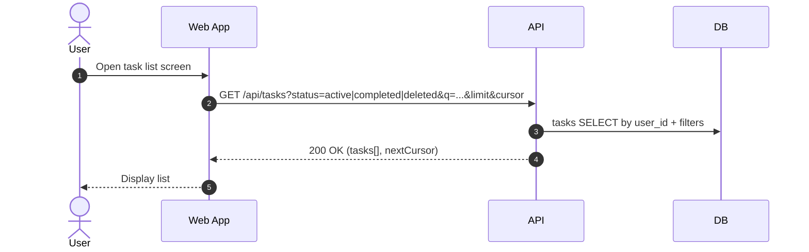
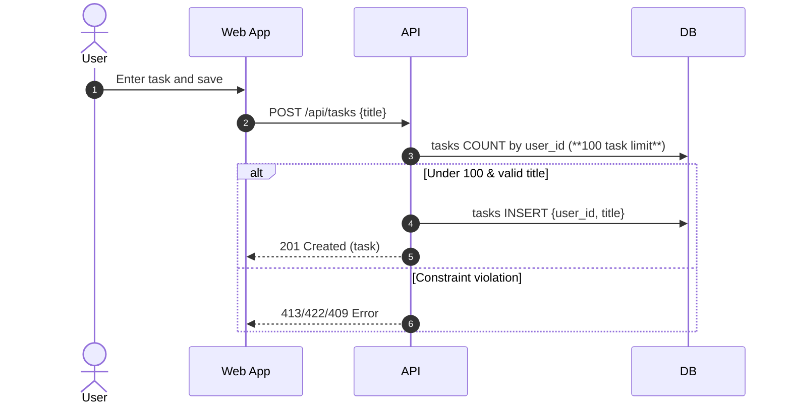
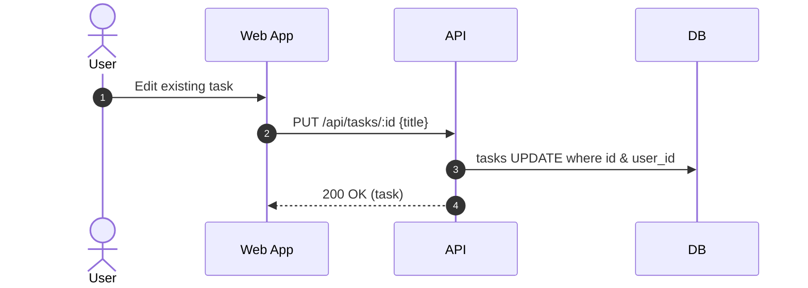
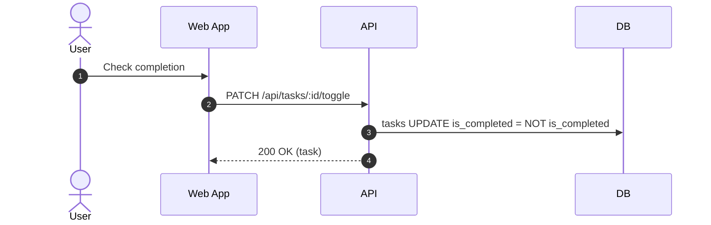
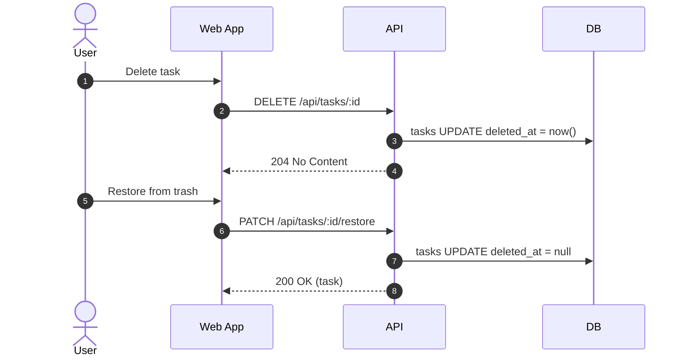
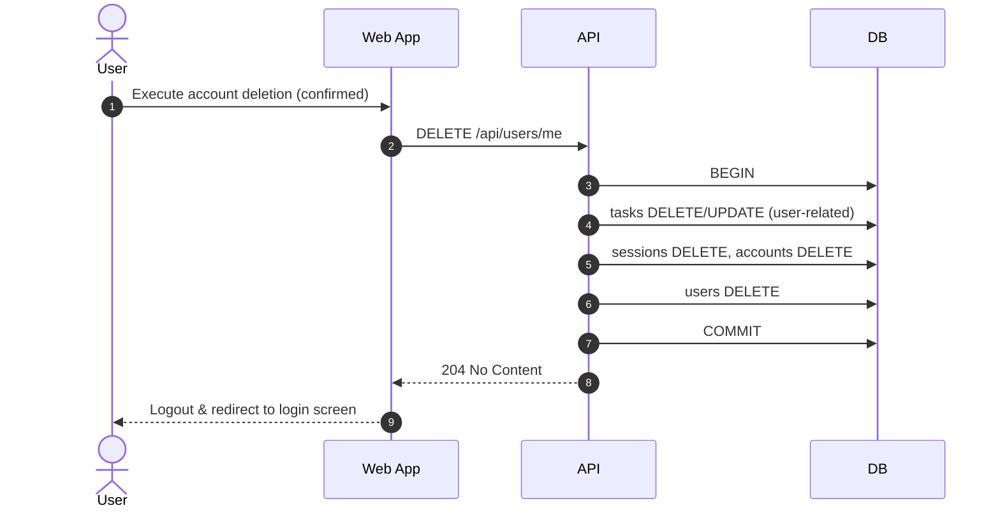

# design.md

## Architecture Overview

- **Configuration**: Frontend (Next.js) + Backend API (Next.js API Routes) + DB (PostgreSQL/Neon)
- **Hosting**: Vercel
- **Data Persistence**: Neon (PostgreSQL)
- **Email Sending**: Resend (registration confirmation & notification emails)
- **Authentication Session**: NextAuth.js (Credentials + Session)
- DB operations via API (user scope at application layer. Consider RLS as needed)

## Tech Stack

- **Frontend**: Next.js 15 (App Router) / TypeScript / Tailwind CSS / shadcn/ui
- **Backend**: Next.js API Routes / Drizzle
- **DB**: Neon (PostgreSQL)
- **Authentication**: NextAuth.js (Email+Password Credentials)
- **Deployment**: Vercel
- **Email**: Resend (shared domain usage)

## Data Model

### User

| Field          | Type           | Notes                                             |
| -------------- | -------------- | ------------------------------------------------- |
| id             | UUID           | PK                                                |
| email          | string         | unique, required                                  |
| password_hash  | string         | Hashed storage (bcrypt)                           |
| username       | string         | ≤8 characters, unique                             |
| name           | string         | Optional (display name)                           |
| image          | string         | Optional (profile image URL)                      |
| email_verified | timestamp/null | Email verification timestamp (null if unverified) |
| created_at     | timestamp      | default now                                       |

---

### Account (for external providers - future expansion)

| Field               | Type           | Notes                                 |
| ------------------- | -------------- | ------------------------------------- |
| user_id             | UUID           | FK → User.id                          |
| type                | string         | Provider type (oauth/credentials etc) |
| provider            | string         | e.g., google, github                  |
| provider_account_id | string         | User ID within provider               |
| access_token        | string/null    | Optional                              |
| refresh_token       | string/null    | Optional                              |
| expires_at          | timestamp/null | Optional                              |

---

### Session

| Field         | Type      | Notes           |
| ------------- | --------- | --------------- |
| session_token | string    | PK              |
| user_id       | UUID      | FK → User.id    |
| expires       | timestamp | Expiration date |

---

### VerificationToken (for NextAuth processing)

| Field      | Type      | Notes                                     |
| ---------- | --------- | ----------------------------------------- |
| identifier | string    | Email address etc (user identifier)       |
| token      | string    | PK equivalent (composite with identifier) |
| expires    | timestamp | Expiration (e.g., 24h)                    |

---

### Task

| Field        | Type           | Notes            |
| ------------ | -------------- | ---------------- |
| id           | UUID           | PK               |
| user_id      | UUID           | FK → User.id     |
| title        | string         | 1-100 characters |
| is_completed | boolean        | default false    |
| deleted_at   | timestamp/null | For soft delete  |
| created_at   | timestamp      | default now      |
| updated_at   | timestamp      | on update        |

---

## ER Diagram

## API Endpoints

### Auth

- `POST /api/auth/register` : User registration (hash password → issue verification_token → send verification email)
- `GET  /api/auth/verify?token=...` : Verification link processing (verify token → update `email_verified`)
- `POST /api/auth/verify/resend` : Resend verification email (unverified users only)
- `POST /api/auth/login` : Login (NextAuth Credentials)
- `POST /api/auth/logout` : Logout
- `GET  /api/auth/session` : Get current session (for guards)

### Tasks (login & verification required)

- `GET    /api/tasks` : Task list (`status=active|completed|deleted`, `q`, `limit`, `cursor`)
- `POST   /api/tasks` : Create task (**100 task limit check**)
- `PUT    /api/tasks/:id` : Edit task (title etc)
- `PATCH  /api/tasks/:id/toggle` : Toggle complete/incomplete
- `DELETE /api/tasks/:id` : Delete task (soft delete: set `deleted_at`)
- `PATCH  /api/tasks/:id/restore` : Restore soft delete (`deleted_at = null`)

### Users

- `DELETE /api/users/me` : Delete account (delete related data in transaction → 204)

---

## Process Flow

### Authentication Flow (Registration → Verification → Login)

### Verification Email Resend

### Basic Operation Process Flow (Tasks)

#### List Retrieval (GET /api/tasks)

#### Creation (POST /api/tasks)

#### Edit (PUT /api/tasks/:id)

#### Complete Toggle (PATCH /api/tasks/:id/toggle)

#### Delete・Restore (DELETE /api/tasks/:id, PATCH /api/tasks/:id/restore)

#### Account Deletion (DELETE /api/users/me)

---

## Authentication & Authorization Design

- Authentication: NextAuth Credentials. If `email_verified` is null, main feature APIs return 403.
- Authorization: API handlers always match `session.user.id` with `user_id`.
  Future possibility to introduce Postgres RLS (application layer mapping equivalent to `auth.uid()`).

## Validation

- `email`: RFC format. Unique.
- `password`: 8+ characters. Hashed with bcrypt.
- `username`: Max 8 characters. Alphanumeric/underscore only. Unique.
- `title`: 1-100 characters. Return 422 if empty after trim.

## Error Handling Policy

- Invalid input: 422 Unprocessable Entity (aggregate details with Zod)
- Not logged in: 401 Unauthorized
- Unverified/insufficient permissions: 403 Forbidden
- Resource not found: 404 Not Found
- Duplicate: 409 Conflict (email/username)
- Limit exceeded: 413 Payload Too Large (over 100 tasks)
- Internal server error: 500 Internal Server Error
  Basic return format: `{ error: { code, message } }`

## Test Design

- **E2E**: Registration → Verification → Login → Task CRUD → Delete → Restore → Logout → Re-login
- **Unit**: UI logic, validation, API handlers
- **API**: HTTP response verification with Supertest (permissions, limits, unauthenticated)

## CI/CD

1. Push to GitHub → GitHub Actions
   - lint & format (ESLint, Prettier)
   - unit & api tests
2. Merge to main → Vercel auto-deploy

## Branch Strategy (GitHub Flow)

- **main**: Production equivalent
- **feature/**\*: Branch per feature development
- PR-based review → merge to main for deployment
- Direct push to main is prohibited in principle
